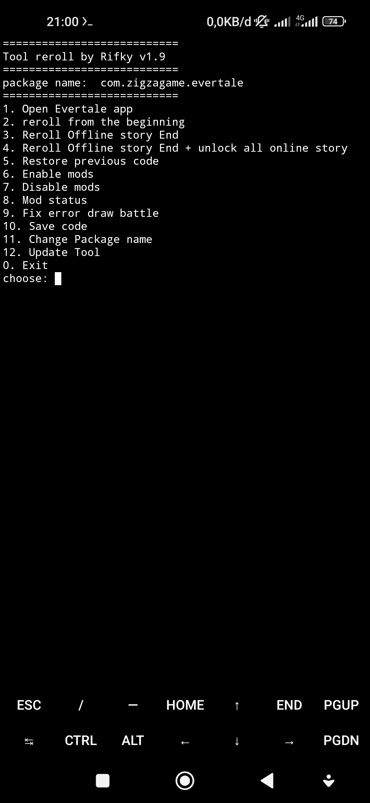

# Reroll for Evertale 
 Easy reroll and other tool, This tools only for Termux and Root access is required

# Requirement tools
+ git
```bash
apt install git
```
+ tsu
```bash
apt install tsu
```
+ Storage permissions 
```bash
termux-setup-storage
```
# Installation
```bash
git clone https://github.com/Rifky4/reroll
```
```bash
cd reroll
```
```bash
chmod +x install
```
```bash
./install
```
🔒Unzip password needed
# Run reroll
Run in folder reroll
```bash
./reroll
```
Fast Run
```bash
reroll
```

